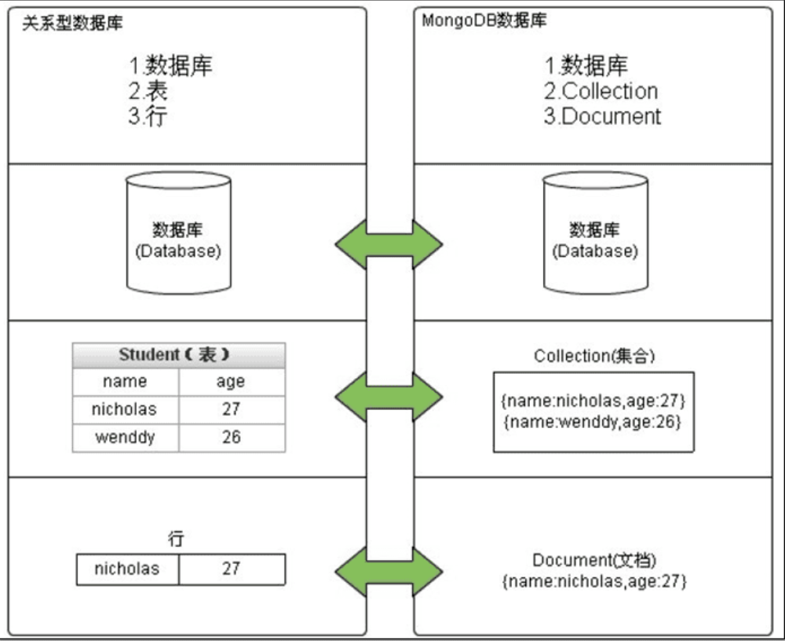

# 数据库 MongoDB 学习笔记

1. 数据库(database)：项目中只需一个，ims-db
2. 集合(collection)：一个数据库中允许创建多个集合，类似sql里的表
3. 文档(document)：相当于sql里的一个实例，用 `bson` 格式

在MongoDB中有几个内建的数据库：
- admin admin库主要存放有数据库帐号相关信息。local local数据库永远不会被复制到从节点，可以用来存储限于本地单台服务器的任意集合副本集的配置信息、- oplog就存储在local库中。重要的数据不要存储在local库，因为没有冗余副本，如果这个节点故障，存储在local库的数据就无法正常使用了。
- config config数据库用于分片集群环境，存放了分片相关的元数据信息。test MongoDB默认创建的一个测试库，连接mongod服务时，如果不指定连接的具体数据库，默认就会连接到test库。

用到的插件 `@fastify/mongodb`
- https://fastify.dev/docs/latest/Guides/Database/
- https://www.npmjs.com/package/@fastify/mongodb
- https://github.com/fastify/fastify-mongodb